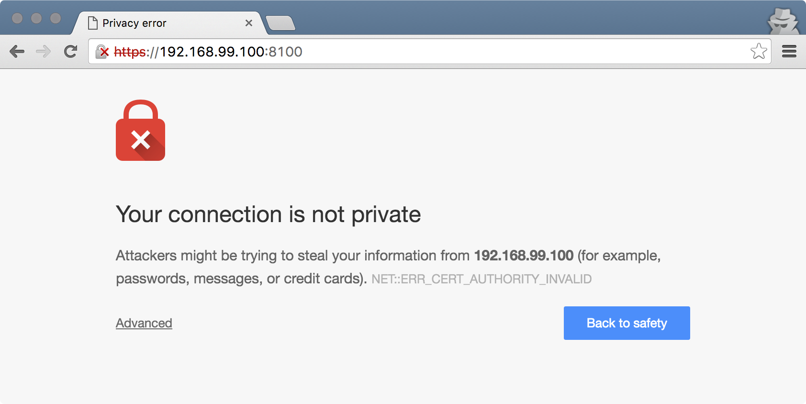
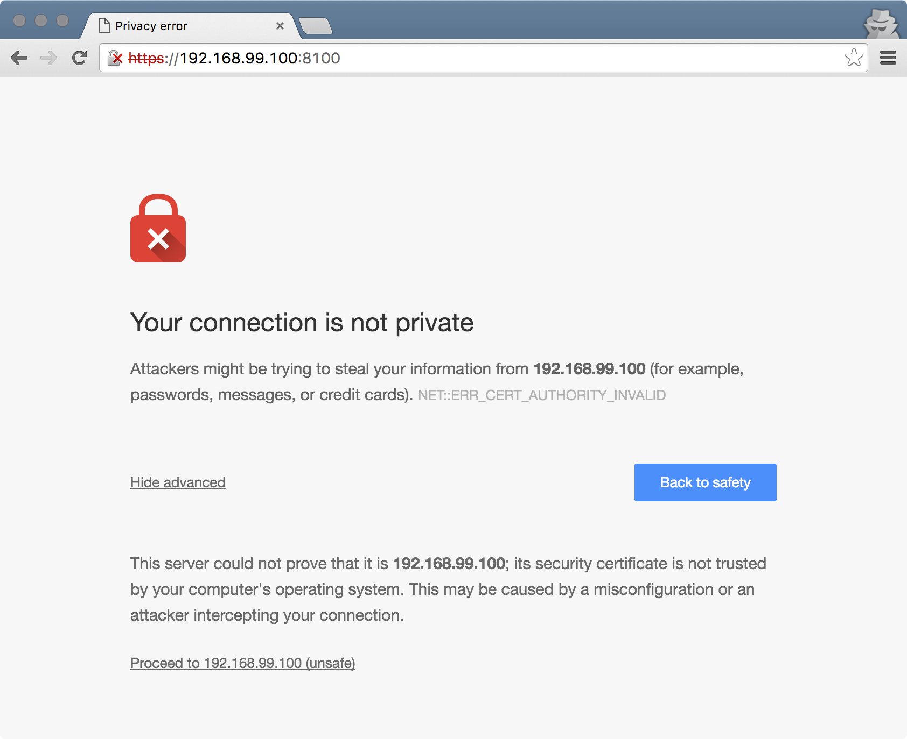
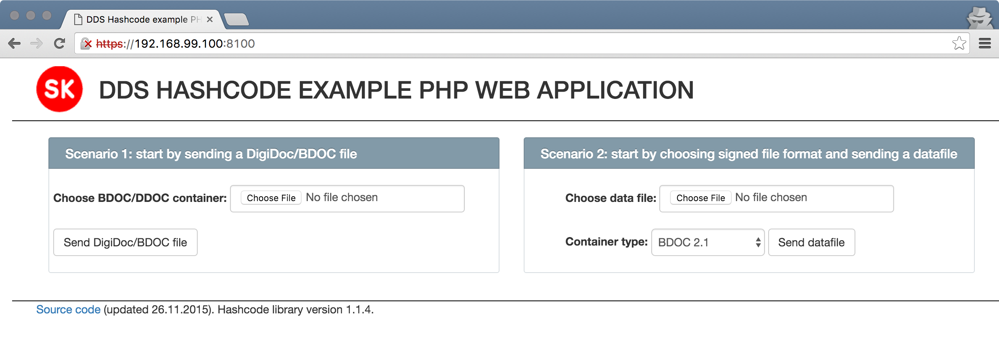

# php-dds-hashcode

Created from dds-hashcode-1.1.3.tar.gz to make possible changes easier to manage
Original source: https://demo.sk.ee/download/dds-hashcode-1.1.3.tar.gz
# DDS Hashcode Sample Web Application

### Features

* Signing existing DDOC and BDOC files with Mobile-ID and ID-card
* Creating new DDOC and BDOC files and signing them with Mobile-ID or with ID-card
* Removing signatures from containers
* Adding data files to container
* Removing data files from container

### Recommended installation requirements

* **Docker Toolbox** must be installed when using **Windows** or **Mac**.
  You can download it from here: <https://www.docker.com/docker-toolbox>
* **Linux** users must install **Docker** and **Docker Compose**

### Manual installation requirements

If You want to setup everything manually then following tools must be installed.

* PHP 5.3+
* Web server like Apache or Nginx. Nginx is preferred because then You can use
  provided configuration files inside `server-config/nginx` directory.

> **NOTE**: Also You need to configure Your web server to use some kind of
> certificate or use provided
> [self signed certificate](https://en.wikipedia.org/wiki/Self-signed_certificate)
> inside the `server-config/nginx/certs` directory.

## Running sample applications

After You have correctly installed `docker` and `docker-compose` then
You can run the application by issuing below command.

```bash
docker-compose up
```

To stop sample application with `docker-compose` issue `stop` command.

```bash
docker-compose stop
```

If You do not like `docker-compose` then You need build and run the
`Dockerfile` yourself by issuing following commands.

```bash
docker build -t sk/dds-hashcode .
docker run -t -i -p 8100:443 sk/dds-hashcode
```

To exit from session just press `Ctrl + c`.

## Opening the sample application

Now we have running application let's how it looks by navigating to
`https://<docker-machine ip dev>:8100`. When You first time open it then most likely
You will see something like below.



The error page is shown because we are using self signed certificates.
To get past just click the **Advanced** link a press then press **Proceed to** link like
shown below.



After You have accepted the self signed certificate You should the
sample application.



> **NOTE** **Never ever** use self signed certificates in production
> environments.
